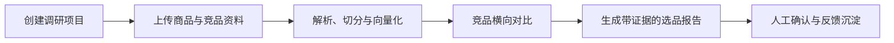

# CommerceLens AI

> 面向电商运营团队的选品调研与竞品对比工作台。平台将商品、竞品、品牌资料和平台规则组织为可检索的证据库，输出带来源依据的选品结论与卖点策略。

## MVP 目标

CommerceLens AI 的首个版本聚焦以下闭环：

1. 创建调研项目，录入自有商品与竞品资料。
2. 上传 Excel、PDF、文本、商品图和竞品截图等调研材料。
3. 异步解析资料并建立可检索的品牌与品类知识库。
4. 横向比较多个商品的卖点、目标人群、价格带与同质化风险。
5. 生成带证据引用的选品报告，并支持人工确认、驳回与补充反馈。

MVP **不包含**商品图片生成、受保护电商平台的自动爬取、自动投放或自动下单。所有结论均应可回溯至已上传或已授权接入的资料。

## 产品流程



## 目标架构

| 服务 | 职责 |
| --- | --- |
| Next.js | 选品项目、商品池、报告和反馈工作台 |
| FastAPI | 商品、资料、知识库、报告和任务 API；SSE 进度推送 |
| Supabase | PostgreSQL 业务数据、pgvector 向量检索、Storage 文件存储 |
| Redis + Worker | 资料解析、Embedding、报告生成与重试任务 |
| Docker Compose | 本地启动 Web、API、Worker 和 Redis，并连接 Supabase |

## 当前实现状态

后端已提供项目、商品/竞品、资料上传、异步解析与 Embedding、证据检索、价格与资料覆盖度对比、规则化选品报告及审核反馈接口。Next.js 首页已改为选品调研工作台。真实 Supabase 项目尚未连接，因此 Migration 仍需在 Supabase Dashboard 或 CLI 中执行。

## 本地开发

```powershell
pnpm install
Copy-Item .env.example .env
pnpm dev
```

Next.js 工作台、FastAPI 与 Supabase 数据模型均已完成；旧新闻模块暂保留在仓库中，待项目稳定后再单独退役。

## Docker Compose

已提供 `web + api + worker + redis` 的 Compose 配置，Supabase 继续承载托管数据库、pgvector 与 Storage。首次运行和演示数据导入见 [Docker Compose 运行说明](./docs/run-with-docker.md)。
