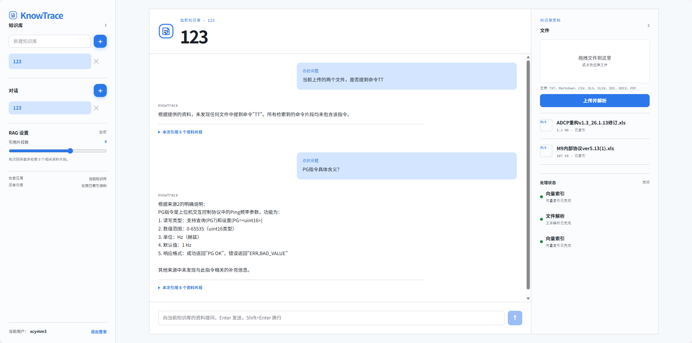
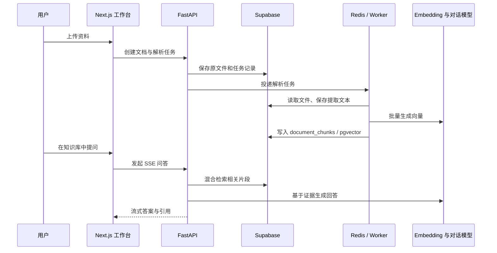

# KnowTrace AI

> 面向个人资料的可追溯知识库：将文件、处理任务、对话与检索证据固定在同一知识库中，让回答能够回到原始资料。

KnowTrace AI 是一个完整的 RAG 知识工作台。用户以用户名和密码登录后，可创建私有知识库、上传文档、观察解析与向量索引进度，并在限定资料范围内发起流式问答。每条回答都会保存引用的文件、片段序号与摘录，避免回答脱离上传资料。

在线体验：[research.xcymm3.top](https://research.xcymm3.top/)



## 产品能力

### 资料入库与索引

- 支持 TXT、Markdown、CSV、XLS/XLSX、DOC/DOCX、PDF 文件上传。
- 原文件存入 Supabase Storage；解析后的文本作为派生文件保存，便于重新建立索引而无需重新上传。
- 后台按“文件解析 → 文本切片 → Embedding → 向量入库”执行任务，并返回实时状态与进度。
- 对旧式 Office 文件和表格中的二进制/设备帧等低可读内容进行过滤，避免无意义内容污染检索结果。

### 可追溯 RAG 对话

- 检索范围严格限制在当前知识库的已索引资料中。
- PostgreSQL 全文检索与 pgvector 语义检索共同召回资料片段。
- LangChain 将检索结果组织为上下文，通过 OpenAI-compatible 对话模型生成回答。
- SSE 将回答逐段返回；对话历史、回答和引用关系持久化保存。
- 左侧可调整单次回答引用的资料片段数，并展开查看本次引用的原文摘录。

### 可恢复的任务与文件管理

- 任务可展示排队、运行、成功、失败、取消五种状态。
- 失败任务可查看失败原因并重新提交；运行中或排队中的任务可取消，取消后仍可重新尝试。
- 删除文件时同步清理原文件、派生文本、向量片段、引用记录与关联任务，避免残留索引继续参与检索。
- 队列暂时不可用时保留持久化的 `QUEUED` 任务，服务恢复后可继续处理。

### 个人数据隔离

- 使用 Supabase Auth 完成注册、登录和会话管理，并以用户名作为登录入口。
- `workspaces.owner_id` 关联身份用户；所有知识库、文档、任务、对话和引用均通过 RLS 按用户隔离。
- API 使用 JWT 校验身份与资源归属；前端只读取当前用户允许访问的数据。

## 核心流程



## 技术架构

```text
Browser
  │
  ▼
Next.js 16 ── Route Handler 代理 ──► FastAPI
  │                                      │
  │ Supabase Auth                         ├── Supabase PostgreSQL + pgvector
  │                                      ├── Supabase Storage
  │                                      ├── Redis + ARQ Worker（容器模式）
  │                                      └── LangChain + OpenAI-compatible API
  ▼
个人知识库工作台
```

| 技术 | 在项目中的职责 |
| --- | --- |
| Next.js 16 + TypeScript | 构建知识库工作台、登录态、文件拖拽上传、任务状态、对话与引用界面；Route Handler 统一代理后端 API。 |
| FastAPI + Pydantic | 提供工作区、文档、任务、检索与 SSE 对话 API；校验请求、JWT 和资源归属。 |
| LangChain | 把检索片段与系统约束连接到对话模型，输出流式、带来源的 RAG 回答。 |
| PostgreSQL + pgvector | 存储业务实体、文本片段、向量与元数据；执行向量相似度和全文关键词混合检索。 |
| Supabase | 提供 Auth、托管 PostgreSQL、Storage、Row Level Security 和迁移执行环境。 |
| Redis + ARQ | 在 Docker 模式下承接解析、切片和向量化等耗时任务，支持重试与任务进度。 |
| Docker Compose | 编排 web、api、worker、redis 四个进程，并复用同一套环境变量连接 Supabase 与模型服务。 |
| Playwright / Pytest / Ruff / ESLint | 覆盖关键交互、后端领域逻辑、静态检查与生产构建。 |

### 两种任务执行方式

| 环境 | 任务执行策略 |
| --- | --- |
| Docker Compose / 长运行服务 | FastAPI 将任务投递给 Redis，ARQ Worker 独立消费，适合持续处理与可扩展部署。 |
| Vercel Serverless | 使用与 Worker 共用的任务处理函数在请求内执行短任务，避免 Vercel 无常驻 Worker 时任务永久排队；任务记录和结果仍写入 Supabase。 |

## 项目目录

```text
knowtrace-ai/
├─ src/                         # Next.js 前端
│  ├─ app/                       # 页面、样式与 API 代理
│  ├─ features/                  # 认证与知识库工作台
│  └─ lib/                       # Supabase 浏览器客户端、API SDK
├─ backend/                      # FastAPI 服务
│  ├─ app/api/                   # 路由、鉴权和依赖注入
│  ├─ app/features/              # 按业务领域组织的核心能力
│  │  ├─ authentication/         # 用户名登录
│  │  ├─ documents/              # 上传、格式识别和文本解析
│  │  ├─ knowledge/              # 切片、Embedding、混合检索
│  │  ├─ conversations/          # 流式问答、消息和引用
│  │  ├─ tasks/                  # ARQ、内联任务、重试/取消/清理
│  │  └─ workspaces/             # 私有知识库管理
│  ├─ tests/                     # 后端单元与接口测试
│  └─ evals/                     # RAG 质量评估样例与脚本
├─ supabase/migrations/          # PostgreSQL、pgvector、RLS 迁移
├─ docs/                         # 产品与工程文档
│  └─ assets/                    # README 与产品界面素材
├─ e2e/                          # Playwright 端到端测试
├─ docker-compose.yml            # 本地全栈编排
├─ Dockerfile                    # Next.js Web 镜像
└─ .env.example                  # 环境变量模板
```

## 本地运行

### 前置条件

- Node.js 22+
- pnpm 11+
- Python 3.12+
- Docker Desktop
- 一个已开启 pgvector 与 Storage 的 Supabase 项目
- 一个 OpenAI-compatible Embedding 服务；如需问答，还需配置对话模型服务

### 1. 初始化配置

```powershell
pnpm install
Copy-Item .env.example .env

Set-Location backend
uv sync --group dev
Set-Location ..
```

在 Supabase SQL Editor 或 Supabase CLI 中，按文件名顺序执行 `supabase/migrations/` 下的迁移。然后根据 `.env.example` 填写：

- `NEXT_PUBLIC_SUPABASE_URL`、`NEXT_PUBLIC_SUPABASE_PUBLISHABLE_KEY`
- `SUPABASE_URL`、`SUPABASE_SERVICE_ROLE_KEY`、`DATABASE_URL`
- `EMBEDDING_BASE_URL`、`EMBEDDING_API_KEY`、`EMBEDDING_MODEL`
- `LLM_BASE_URL`、`LLM_API_KEY`、`LLM_MODEL`

本地 Docker Compose 会自动为 API 与 Worker 提供 `redis://redis:6379`，不需要在 `.env` 中填写本地 Redis 地址。

### 2. 启动完整服务

```powershell
docker compose up --build
```

打开 `http://localhost:3001`。服务地址如下：

| 服务 | 地址 |
| --- | --- |
| Web 工作台 | `http://localhost:3001` |
| FastAPI 文档 | `http://localhost:8000/docs` |
| Redis | Compose 内部网络，仅供 API 与 Worker 使用 |

## 质量验证

```powershell
# 前端：Lint、端到端测试和生产构建
pnpm lint
pnpm test:e2e
pnpm build

# 后端：在 backend 目录执行
uv run ruff check .
uv run python -m pytest

# RAG 评估：使用问题集检查引用覆盖和回答依据
uv run python evals/run_rag_quality.py --dataset evals/fixtures/rag-quality-sample.json
```

RAG 评估的指标、问题集格式与使用方式见 [RAG 质量验证](docs/rag-quality.md)。

## 部署说明

- **推荐完整部署**：以 Docker Compose 或独立容器部署 Web、FastAPI、Worker、Redis；Supabase 保持托管。
- **Vercel 部署**：可部署 Next.js 与 FastAPI 路由；短文件任务使用内联执行模式。需配置 Supabase、Embedding 与 LLM；若改用容器队列模式，再额外配置 Redis。
- **数据安全**：前端只使用 Supabase Publishable Key；Service Role Key 仅由后端容器或 Serverless 函数使用，绝不写入 `NEXT_PUBLIC_*` 环境变量。

更完整的配置见以下文档：

- [产品范围](docs/product-scope.md)
- [Supabase 初始化](docs/supabase-setup.md)
- [Docker Compose 运行](docs/run-with-docker.md)
- [部署说明](docs/deployment.md)
- [数据模型](docs/data-model.md)
- [API 契约](docs/api-contract.md)
- [端到端测试](docs/end-to-end-testing.md)

## 当前版本边界

当前版本聚焦单用户、私有资料与可追溯问答，暂未实现团队协作、复杂角色权限、联网搜索、OCR、图片内容理解、多模型路由和 Agent 工具调用。所有回答仅以当前知识库中已索引的资料为依据。
