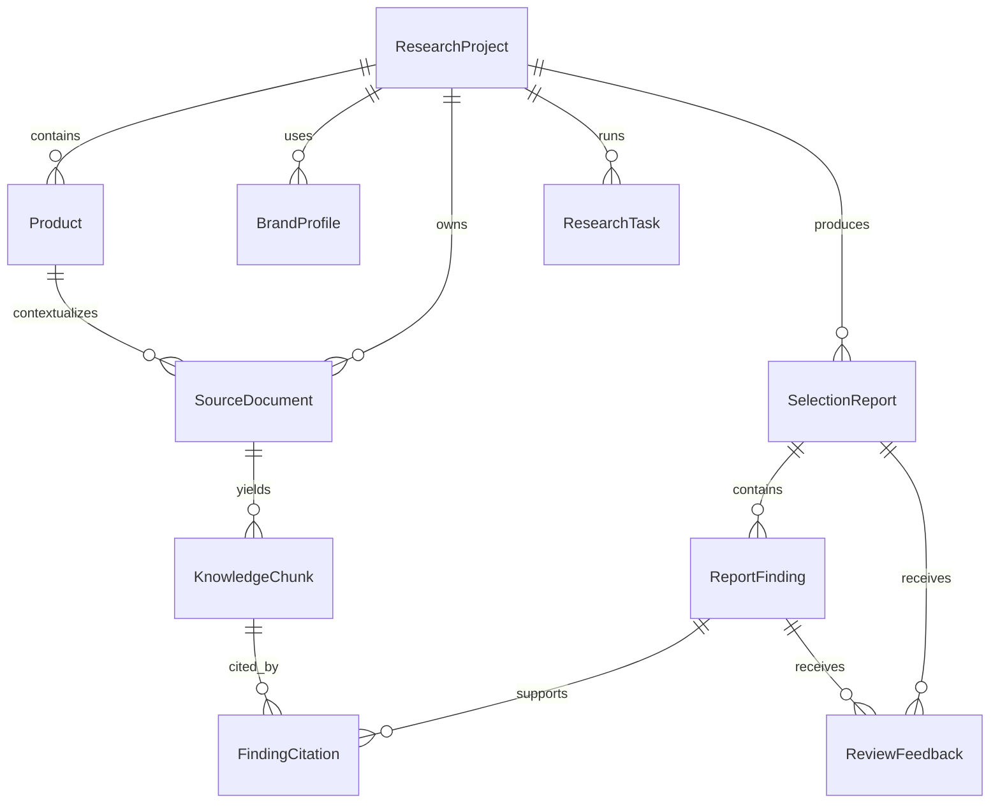

# CommerceLens AI 数据模型（MVP v1）

本文件定义 CommerceLens AI 的业务模型，是 Supabase Migration、FastAPI Schema 和前端类型的共同依据。

## 设计目标

- 将一次选品调研作为独立、可追溯的 `ResearchProject` 管理。
- 将自有商品与竞品统一建模为 `Product`，仅通过角色区分，便于横向比较。
- 原始 Excel、PDF、文本、商品图片和截图存入 Supabase Storage；数据库只保存其元数据与对象路径。
- 任何报告结论都可回溯到具体资料与知识库文本片段，禁止只有模型结论而没有依据。
- 异步解析、Embedding、比较和报告生成均记录为 `ResearchTask`，以支持进度、失败原因和重试。
- MVP 不接入 Supabase Auth；所有数据仅由 FastAPI 使用 Service Role 访问。表仍启用 RLS，为后续接入用户隔离预留边界。

## 实体关系

## 枚举

| 枚举 | 值 | 说明 |
| --- | --- | --- |
| `ProjectStatus` | `DRAFT`、`ACTIVE`、`ARCHIVED` | 调研项目生命周期 |
| `ProductRole` | `OWN`、`COMPETITOR` | 自有候选商品或竞品 |
| `DocumentKind` | `PRODUCT_SHEET`、`COMPETITOR_SHEET`、`BRAND_GUIDE`、`PLATFORM_RULE`、`REVIEW_EXPORT`、`PRODUCT_IMAGE`、`COMPETITOR_SCREENSHOT`、`OTHER` | 上传资料类型 |
| `DocumentStatus` | `PENDING`、`PROCESSING`、`READY`、`FAILED` | 文件解析状态 |
| `TaskType` | `PARSE_DOCUMENT`、`GENERATE_EMBEDDINGS`、`COMPARE_PRODUCTS`、`GENERATE_REPORT` | 异步任务类型 |
| `TaskStatus` | `QUEUED`、`RUNNING`、`SUCCEEDED`、`FAILED`、`CANCELLED` | 异步任务状态 |
| `ReportStatus` | `DRAFT`、`READY_FOR_REVIEW`、`APPROVED`、`REJECTED`、`SUPERSEDED` | 报告状态 |
| `FindingType` | `RECOMMENDATION`、`DIFFERENTIATOR`、`RISK`、`AUDIENCE_INSIGHT`、`CONTENT_STRATEGY` | 报告结论分类 |
| `ReviewDecision` | `APPROVED`、`REJECTED`、`NEEDS_REVISION` | 人工反馈结果 |

## 核心实体

### `research_projects`

一次完整的选品或竞品调研。一个项目包含多个商品、资料、任务与报告。

| 字段 | 说明 |
| --- | --- |
| `id` | UUID 主键 |
| `name` | 项目名称，例如“夏季防晒新品选品” |
| `category` | 目标品类，可为空 |
| `target_platform` | 目标平台，可为空 |
| `target_audience` | 目标人群描述，可为空 |
| `status` | 项目状态，默认 `DRAFT` |
| `created_at` / `updated_at` | UTC 审计时间 |

### `brand_profiles`

项目使用的品牌约束。实际品牌手册以 `source_documents` 保存，结构化约束可直接参与检索过滤和报告生成。

| 字段 | 说明 |
| --- | --- |
| `project_id` | 所属调研项目 |
| `name` | 品牌或店铺名称 |
| `tone` | 品牌表达风格，可为空 |
| `forbidden_terms` | 禁用词数组 |
| `guidelines` | 结构化品牌约束 JSON |

### `products`

项目内的候选商品与竞品。MVP 中不依赖外部平台抓取，资料通过人工录入或授权上传进入系统。

| 字段 | 说明 |
| --- | --- |
| `project_id` | 所属调研项目 |
| `role` | `OWN` 或 `COMPETITOR` |
| `name` / `brand_name` | 商品与品牌名称 |
| `external_url` | 人工提供或授权获取的商品链接，可为空 |
| `price` / `currency` | 当前观察到的价格与币种，可为空 |
| `description` | 商品简介或卖点原文 |
| `attributes` | 规格、销量区间、评价数等结构化补充信息 JSON |

### `source_documents`

原始调研材料的元数据。文件本体位于 Supabase Storage 的 `research-assets` Bucket。

| 字段 | 说明 |
| --- | --- |
| `project_id` | 所属调研项目 |
| `product_id` | 关联商品，可为空；品牌手册或平台规则可不绑定商品 |
| `kind` | 文件类型 |
| `file_name` / `mime_type` / `size_bytes` | 原始文件信息 |
| `storage_bucket` / `storage_path` | Supabase Storage 对象定位 |
| `checksum` | 去重与完整性校验 |
| `status` / `error_message` | 解析状态与安全错误摘要 |
| `metadata` | 页数、表名、图像尺寸、导入来源等 JSON |

### `knowledge_chunks`

文件解析后的可检索片段。MVP 固定采用 1536 维 Embedding；后续切换模型时应增加 `embedding_model` 与迁移策略，而不是混用不同维度。第 7 步还为内容建立 `search_vector`，以语义分数 75% + 关键词分数 25% 排序；结果只返回 `READY` 资料，并带回原始文件与片段位置。

| 字段 | 说明 |
| --- | --- |
| `document_id` | 来源资料 |
| `chunk_index` | 文件内稳定排序 |
| `content` | 已清洗的文本片段 |
| `embedding` | `vector(1536)`，用于语义检索 |
| `search_vector` | 从 `content` 自动生成的全文检索向量，用于关键词检索 |
| `token_count` | 切片长度，用于控制上下文 |
| `metadata` | 页码、工作表、单元格范围、OCR 置信度等 JSON |

### `research_tasks`

FastAPI 创建、Redis Worker 执行的异步任务记录。任务状态是前端轮询与 SSE 进度的唯一来源。

| 字段 | 说明 |
| --- | --- |
| `project_id` / `document_id` | 任务上下文 |
| `task_type` / `status` | 任务类型及生命周期 |
| `progress` | 0–100 的进度值 |
| `attempt_count` / `max_attempts` | 重试控制 |
| `input_payload` / `output_payload` | 不含密钥的任务输入输出摘要 JSON |
| `error_message` | 脱敏错误摘要 |
| `started_at` / `completed_at` | 任务耗时计算依据 |

### `selection_reports`、`report_findings` 与 `finding_citations`

一份报告可产生多个结论。结论通过引用关系关联到知识库片段，确保“推荐优先级、差异化机会和风险提示”都能展示来源。

| 实体 | 关键字段 | 说明 |
| --- | --- | --- |
| `selection_reports` | `project_id`、`title`、`summary`、`status`、`generation_metadata` | 报告正文与生成上下文 |
| `report_findings` | `report_id`、`type`、`title`、`content`、`confidence`、`position` | 一条可审核的报告结论 |
| `finding_citations` | `finding_id`、`chunk_id`、`excerpt`、`position` | 结论与材料片段的证据关系 |

### `review_feedback`

运营或类目负责人对报告整体或单条结论给出的审核结果。MVP 不要求登录，因此 `reviewer_label` 仅保存显示名称；后续接入 Auth 后替换为用户外键。

| 字段 | 说明 |
| --- | --- |
| `report_id` / `finding_id` | 反馈范围；至少关联其中之一 |
| `decision` | 通过、驳回或要求修改 |
| `comment` | 人工原因或补充信息 |
| `reviewer_label` | MVP 审核者显示名称 |

## 完整性规则

1. 仅 `READY` 状态的 `source_documents` 可以产生 `knowledge_chunks`。
2. `knowledge_chunks` 的 `(document_id, chunk_index)` 必须唯一；Embedding 为空的片段不得参与语义检索。
3. 每个 `report_findings` 至少有一条 `finding_citations` 才能进入 `READY_FOR_REVIEW` 状态。
4. `finding_citations.excerpt` 必须是对应片段的受控短摘录，不保存或输出无关文件全文。
5. 失败任务不可自动覆盖已成功报告；重试应创建新任务或增加尝试计数并保留错误摘要。
6. 文件对象路径必须以 `project_id/` 开头，避免跨项目错误引用。

## 后续映射

- 第 3 步：在 Supabase 创建 `pgvector` 扩展、Bucket、RLS 与本文件对应的 Migration。
- 第 4 步：FastAPI Pydantic Schema 与 API 使用本文件的命名及状态枚举。
- 第 7 步：Worker 按 `source_documents → knowledge_chunks → finding_citations` 实现可追溯 RAG。
- 第 8 步：已实现项目、商品、竞品对比、选品报告与人工反馈接口；报告以规则方式生成，且每条结论均有引用。
