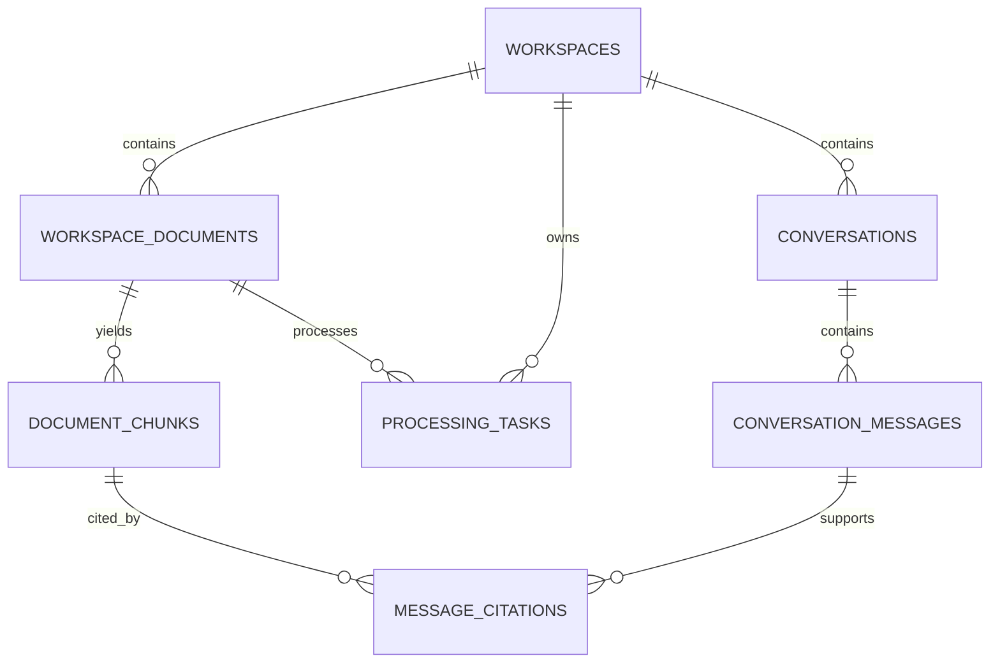

# KnowTrace AI 数据模型（MVP）

Supabase 是 KnowTrace 的持久化层。浏览器不直连 Supabase；FastAPI 与 Worker 通过 Service Role 访问业务表和私有 Storage。

| 实体 | 用途 |
| --- | --- |
| `workspaces` | 项目级边界：名称、描述、状态和审计时间。 |
| `workspace_documents` | 已上传文件的元数据、Storage 路径、状态和解析错误摘要。 |
| `document_chunks` | 文件切片、1536 维向量、全文检索向量和原文位置元数据。 |
| `processing_tasks` | 解析和 Embedding 任务的进度、重试次数、输入输出摘要。 |
| `conversations` | 工作区内可独立保存的对话标题与更新时间。 |
| `conversation_messages` | 用户、助手或系统消息及会话内稳定顺序。 |
| `message_citations` | 助手回答与资料切片之间的引用关系及受控摘录。 |

## 状态与边界

- 文件状态：`PENDING → PROCESSING → PARSED → READY`，失败时为 `FAILED`。
- 只有 `READY` 文件的 `document_chunks` 能参与检索。
- 每个 Storage 路径以 `{workspace_id}/` 开头，防止跨工作区引用。
- `message_citations.excerpt` 最长 1200 字符，不存储或展示无关全文。
- `document_chunks.embedding` 固定为 `vector(1536)`；更换 Embedding 模型时需要新迁移与重建索引，不能混用不同维度。
